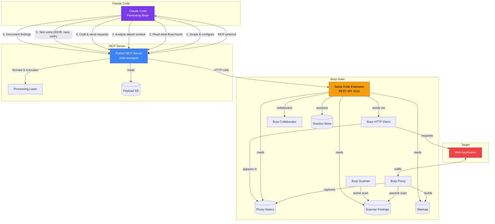
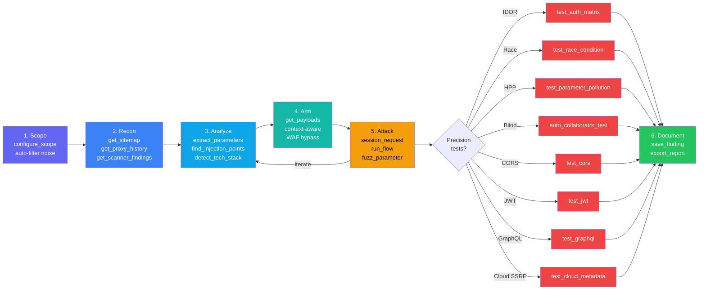
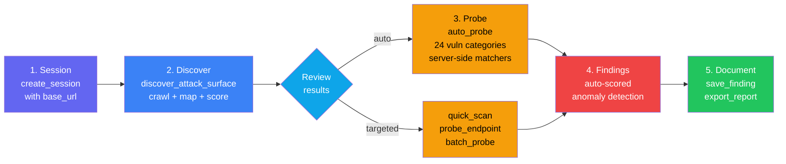

# Burp Suite Swiss Knife MCP

[](https://opensource.org/licenses/Apache-2.0)

Claude Code as your pentesting brain — connected to Burp Suite.

## Architecture



## Workflows

### Manual Workflow (step-by-step control)



### Adaptive Scan Workflow (knowledge-driven automation)



## Setup

### Quick Setup (recommended)

```bash
chmod +x setup.sh && ./setup.sh
```

This installs all required dependencies (Java 21, Maven, Python 3.11+, uv, Go), builds the project, installs optional recon tools (subfinder, httpx, nuclei, katana), and generates `.mcp.json`.

### Manual Setup

### 1. Build & Load the Burp Extension

```bash
cd burp-extension
mvn package
```

Load `target/burpsuite-swiss-knife-0.2.0.jar` in Burp Suite:
- **Extensions → Add → Java → Select JAR**
- Verify: check Burp's output log for "Swiss Knife MCP started on port 8111"

### 2. Install the Python MCP Server

```bash
cd mcp-server
uv venv
uv pip install -e .
```

### 3. Configure Claude Code

Create a `.mcp.json` file in the project root. Replace the path with the actual path to your cloned repo.

**Linux:**
```json
{
  "mcpServers": {
    "burpsuite": {
      "command": "/home/user/burpsuite-swiss-knife-mcp/mcp-server/.venv/bin/python",
      "args": ["-m", "burpsuite_mcp"]
    }
  }
}
```

**macOS:**
```json
{
  "mcpServers": {
    "burpsuite": {
      "command": "/Users/user/burpsuite-swiss-knife-mcp/mcp-server/.venv/bin/python",
      "args": ["-m", "burpsuite_mcp"]
    }
  }
}
```

**Windows:**
```json
{
  "mcpServers": {
    "burpsuite": {
      "command": "C:\\Users\\user\\burpsuite-swiss-knife-mcp\\mcp-server\\.venv\\Scripts\\python.exe",
      "args": ["-m", "burpsuite_mcp"]
    }
  }
}
```

> **Note:** `.mcp.json` is gitignored — each user creates their own with their local path.

## Tools (88 total)

### Scope & Configuration
| Tool | Description |
|------|-------------|
| `configure_scope` | One-call scope setup with include/exclude patterns + auto-filter ~60 tracker/ad/CDN noise domains |
| `get_scope` | Current target scope rules |
| `check_scope` | Check if URL is in scope |
| `add_to_scope` | Add URL to scope |
| `remove_from_scope` | Remove URL from scope |

### Session Management
| Tool | Description |
|------|-------------|
| `create_session` | Persistent attack session with cookies, headers, auth tokens |
| `session_request` | Craft any request freely — auto-applies session state, cookie jar auto-updates |
| `extract_token` | Pull CSRF/session/any value from responses via regex, json_path, header, cookie |
| `run_flow` | Multi-step attack chain in one call — login + extract CSRF + exploit with `{{variable}}` interpolation |
| `list_sessions` | List active sessions with state summary |
| `delete_session` | Clean up sessions |

### Read (what Burp found)
| Tool | Description |
|------|-------------|
| `get_proxy_history` | Proxy history with filters (URL, method, status) |
| `get_request_detail` | Full request/response for a history item |
| `get_scanner_findings` | Scanner findings by severity/confidence |
| `get_sitemap` | All discovered URLs from sitemap |
| `get_cookies` | Cookies from Burp's cookie jar |
| `get_websocket_history` | WebSocket messages from proxy |

### Analyze (attack surface)
| Tool | Description |
|------|-------------|
| `extract_parameters` | All params from a request (query, body, cookie) |
| `extract_forms` | HTML forms and inputs from response |
| `extract_api_endpoints` | API paths, JS fetch calls, links |
| `find_injection_points` | Risk-scored injection points (SQLi, XSS, SSRF...) |
| `detect_tech_stack` | Server tech, frameworks, security headers |
| `extract_js_secrets` | AWS keys, tokens, passwords, internal URLs (TruffleHog-quality) |
| `get_unique_endpoints` | Deduplicated endpoints with parameter names |
| `smart_analyze` | One-call combined analysis — tech stack, injection points, parameters, forms, secrets |
| `analyze_dom` | DOM structure + JS sink/source/prototype pollution analysis |

### Send (through Burp)
| Tool | Description |
|------|-------------|
| `send_http_request` | Send structured HTTP request through Burp |
| `send_raw_request` | Send raw HTTP bytes (request smuggling) |
| `curl_request` | curl-like with redirects, Basic/Bearer auth, cookies |
| `resend_with_modification` | Modify and resend a history request |
| `send_to_repeater` | Send request to Repeater tab |
| `send_to_intruder` | Send request to Intruder |

### Adaptive Scan Engine
| Tool | Description |
|------|-------------|
| `scan_target` | Two-mode scan: discover attack surface OR probe parameters with knowledge-driven detection |
| `discover_attack_surface` | Crawl target and map endpoints, parameters (risk-scored), forms, tech stack in one call |
| `auto_probe` | Knowledge-driven vulnerability probing — auto-detects tech, selects matching probes from 25 categories |
| `quick_scan` | Send request + auto-analyze in one call — returns tech stack, injection points, params, secrets |
| `probe_endpoint` | Adaptive vulnerability probe — auto-selects payloads for SQLi/XSS/SSTI/RCE, checks reflection |
| `batch_probe` | Test multiple endpoints in one call — returns status, length, timing for each |
| `discover_hidden_parameters` | Arjun-style hidden parameter discovery — brute-force param names, detect anomalies |
| `full_recon` | One-call recon pipeline (quick/standard/deep) — tech stack, endpoints, secrets, headers, priorities |
| `bulk_test` | Test all endpoints for one vuln type — sqli, xss, lfi, ssrf, ssti, cmdi, open_redirect |

### Precision Attack Tools
| Tool | Description |
|------|-------------|
| `test_auth_matrix` | Test N endpoints x M auth states — detects IDOR and broken access control |
| `test_race_condition` | Fire N concurrent requests simultaneously — detects double-spend, TOCTOU |
| `test_parameter_pollution` | Test HPP across query/body/mixed positions |
| `fuzz_parameter` | Smart fuzzing with sniper/battering_ram/pitchfork/cluster_bomb modes + smart_payloads auto-selection |
| `compare_auth_states` | Compare responses with/without auth for IDOR detection |
| `compare_responses` | Enhanced response diff (headers, body, unique words) |
| `send_to_comparer` | Send two items to Burp's Comparer |

### Edge-Case Security Tests
| Tool | Description |
|------|-------------|
| `test_cors` | Test CORS configuration — origin reflection, null bypass, wildcard+credentials |
| `test_jwt` | Analyze JWT for vulnerabilities — alg:none, key confusion, jku/x5u injection, kid SQLi |
| `test_graphql` | Test GraphQL endpoint — introspection, field suggestions, batch queries, GET-based CSRF |
| `test_cloud_metadata` | Test SSRF to cloud metadata — AWS IMDSv1/v2, GCP, Azure, DigitalOcean |
| `discover_common_files` | Probe for sensitive files — .git, .env, actuator, debug endpoints, API docs |
| `test_open_redirect` | Test open redirects with Collaborator-verified payloads — protocol-relative, encoding bypasses |
| `test_lfi` | Test LFI/path traversal — Linux/Windows traversal, PHP wrappers, null bytes, encoding bypasses |
| `test_file_upload` | Test file upload bypasses — double extension, content-type mismatch, polyglot, SVG XSS |

### Payload & Knowledge Base
| Tool | Description |
|------|-------------|
| `get_payloads` | Context-aware payloads from HackTricks/PayloadsAllTheThings — XSS, SQLi, SSTI, SSRF, command injection, path traversal, XXE, auth bypass, CORS, CSRF, race condition, HPP, open redirect, LFI, file upload |

> **Knowledge base:** 25 categories with server-side matchers for auto-probe: SQLi, XSS, SSTI, SSRF, command injection, path traversal, XXE, auth bypass, CORS, CSRF, race condition, HPP, IDOR, JWT, GraphQL, deserialization, CRLF injection, open redirect, mass assignment, request smuggling, LLM injection, info disclosure, WebSocket, file upload, tech-specific vulns

### Target Intelligence (persistent memory)
| Tool | Description |
|------|-------------|
| `save_target_intel` | Persist target context (profile, endpoints, coverage, findings, fingerprint, patterns) across sessions |
| `load_target_intel` | Load stored intel — use `"all"` for compact summary or specific category |
| `check_target_freshness` | Fingerprint key pages to detect changes since last session |
| `save_target_notes` | Save freeform markdown notes (human-editable observations and corrections) |
| `lookup_cross_target_patterns` | Find attack patterns from OTHER targets with overlapping tech stack — techniques from target A inform target B |

> **Memory system:** Data stored in `.burp-intel/<domain>/` (gitignored). Finding states: suspected, confirmed, stale, likely_false_positive. Knowledge version tracking triggers re-testing when probes are updated. Cross-target pattern learning shares successful techniques across targets by tech stack.

### CVE Intelligence
| Tool | Description |
|------|-------------|
| `check_tech_vulns` | Match detected tech stack against known CVEs and misconfigurations from knowledge base |
| `search_cve` | Generate CVE search URLs for NVD, Exploit-DB, GitHub Advisory, with nuclei template suggestions |

### Professional Reporting
| Tool | Description |
|------|-------------|
| `generate_report` | Full pentest report with executive summary, methodology, sorted findings, coverage, recommendations |
| `format_finding_for_platform` | Format a finding for HackerOne, Bugcrowd, Intigriti, or Immunefi submission |

### External Recon (optional tools)
| Tool | Description |
|------|-------------|
| `check_recon_tools` | Check which external recon tools are installed (subfinder, httpx, nuclei, etc.) |
| `run_subfinder` | Enumerate subdomains passively via subfinder |
| `run_httpx` | Probe live hosts with tech detection via httpx |
| `run_nuclei` | Run nuclei vulnerability scanner with template/tag/severity filtering |
| `run_recon_pipeline` | Full recon chain: subfinder → httpx → nuclei with graceful degradation |

### Correlate
| Tool | Description |
|------|-------------|
| `search_history` | Search history by query, method, status |
| `get_findings_for_endpoint` | All findings (scanner + manual) for a URL |
| `get_response_diff` | Diff two responses |

### Scanner (Burp Professional)
| Tool | Description |
|------|-------------|
| `scan_url` | Start active scan on URL(s) |
| `crawl_target` | Spider/crawl to discover endpoints |
| `get_scan_status` | Check scan progress |

### Collaborator (OOB testing)
| Tool | Description |
|------|-------------|
| `generate_collaborator_payload` | Generate Collaborator URL for blind testing |
| `get_collaborator_interactions` | Check for DNS/HTTP/SMTP callbacks |
| `auto_collaborator_test` | One-step: inject + send + poll for blind vulns |

### Export & Resources
| Tool | Description |
|------|-------------|
| `export_sitemap` | Export as compact JSON or OpenAPI 3.0 |
| `get_static_resources` | List JS/CSS/source maps in proxy history |
| `fetch_resource` | Fetch specific JS/CSS file content |
| `fetch_page_resources` | Auto-fetch all resources linked from a page |

### Notes & Reporting
| Tool | Description |
|------|-------------|
| `save_finding` | Save a vulnerability finding |
| `get_findings` | List saved findings |
| `export_report` | Export as markdown or JSON report |

### Utility
| Tool | Description |
|------|-------------|
| `decode_encode` | base64, URL, HTML, hex, JWT decode, MD5/SHA1/SHA256, double URL encode, unicode escape |

## Bug Bounty Skills

Claude Code skills in `.claude/skills/` that encode expert bug bounty methodology:

| Skill | Purpose |
|-------|---------|
| `hunt.md` | Systematic vulnerability hunting — loads target memory, checks freshness, tests by tech-adaptive priority (PHP: SQLi/LFI/upload, Java: deser/XXE, API: IDOR/auth), saves progress at checkpoints |
| `verify-finding.md` | 7-Question Validation Gate + evidence requirements for 17 vuln types + NEVER SUBMIT list (23+ non-reportable findings). False positive gating: 2+ failures = likely_false_positive |
| `resume.md` | Continue from previous session — re-verify findings on changed endpoints, show coverage dashboard, suggest prioritized next actions |
| `chain-findings.md` | Exploit chain building — escalate low-severity findings via A→B→C chains. Escalation table maps every low finding to chain paths with required evidence |
| `report-templates.md` | Platform-specific reports for HackerOne, Bugcrowd, Intigriti, Immunefi. CVSS 3.1 reference, quality checklist, severity inflation red flags |
| `autopilot.md` | Autonomous hunt loop — circuit breaker (5x 403 = stop), rate limiting, checkpoint modes (paranoid/normal/aggressive), scope guard, emergency stop |
| `dispatch-agents.md` | Parallel agent orchestration — 5 dispatch patterns with prompt templates, 2.5x speedup |
| `burp-workflow.md` | Tool selection decision trees for 87 MCP tools |
| `investigate.md` | Deep anomaly investigation — filter mapping, finding escalation, attack chaining |
| `craft-payload.md` | WAF/filter bypass engineering — filter recon, encoding chains, incremental testing |
| `static-dynamic-analysis.md` | JS source analysis, DOM sink/source tracing, behavioral profiling, page change detection |

Always-active rules in `.claude/rules/`:

| Rule | Purpose |
|------|---------|
| `hunting.md` | 20 behavioral constraints enforced every turn — scope safety, evidence requirements, 7-Question Gate, NEVER SUBMIT list |

## Design Philosophy

- **Precision over spray** — no mass brute force or enumeration. Use nuclei/sqlmap/ffuf for that. This tool focuses on intelligent, context-aware vulnerability testing.
- **Token efficient** — one smart tool call > five chatty ones. `run_flow` executes multi-step attacks in a single call. `discover_attack_surface` + `auto_probe` replaces dozens of manual calls.
- **Claude crafts the attack** — tools are execution engines, not decision makers. Claude thinks, tools execute.
- **Building blocks + smart helpers** — low-level primitives for creative attack chaining, plus high-level tools where server-side coordination matters (race conditions, auth matrix).
- **Two knowledge systems** — `payloads/` (15 files) for `get_payloads` tool with human-readable attack recipes. `knowledge/` (25 files) for `auto_probe` engine with server-side matchers and anomaly detection.
- **Knowledge fills gaps** — Claude knows basic payloads but not Angular sandbox bypass or Spring SSTI. The curated knowledge base provides advanced/evasive techniques (WAF bypass, blind injection, framework-specific SSTI).
- **Persistent memory** — target intel survives across sessions. Claude remembers tech stack, endpoints, test coverage, and findings without re-scanning. Staleness detection ensures memory stays fresh.
- **Zero false positives** — findings require reproducible evidence (Collaborator callbacks, timing anomalies, error strings). Re-verification on resume catches patched or intermittent issues.

## Environment Variables

| Variable | Default | Description |
|----------|---------|-------------|
| `BURP_API_HOST` | `127.0.0.1` | Burp extension host |
| `BURP_API_PORT` | `8111` | Burp extension port |
| `BURP_API_TIMEOUT` | `30` | Request timeout (seconds) |
| `BURP_MAX_RESPONSE_SIZE` | `50000` | Max response body chars |
| `BURP_PROXY_HOST` | `127.0.0.1` | Burp proxy listener host |
| `BURP_PROXY_PORT` | `8080` | Burp proxy listener port |

## Requirements

- Burp Suite Professional (for scanner + collaborator) or Community Edition
- Java 21+
- Python 3.11+
- Claude Code

## Supported Platforms

- **Linux** (tested)
- **macOS** (tested)
- **Windows** (supported — use `.venv\Scripts\python.exe` in config)

Both the Java Burp extension and Python MCP server use platform-independent libraries. No OS-specific dependencies.

## License

This project is licensed under the [Apache License 2.0](LICENSE).

This tool integrates with Burp Suite (a product of PortSwigger Ltd) and is not affiliated with or endorsed by PortSwigger. Use responsibly and only on systems you have authorization to test.
