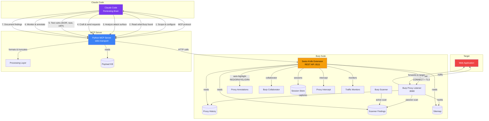
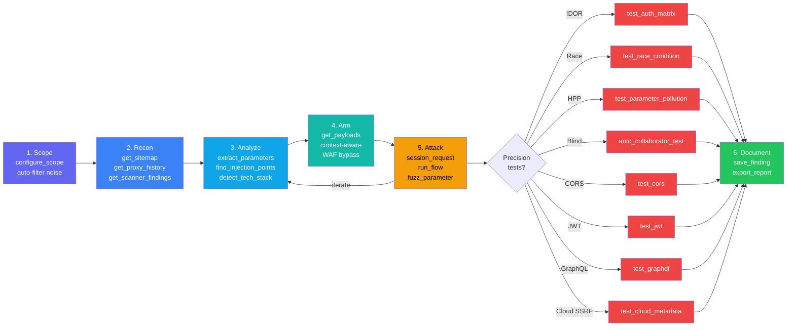
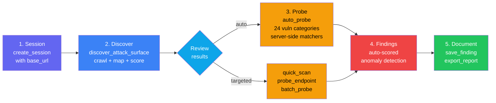

# Burp Suite Swiss Knife MCP

[](https://opensource.org/licenses/Apache-2.0)

Claude Code as your pentesting brain — connected to Burp Suite.

## Architecture



## Workflows

### Manual Workflow (step-by-step control)



### Adaptive Scan Workflow (knowledge-driven automation)



## Setup

### Quick Setup (recommended)

**Linux / macOS:**

```bash
chmod +x setup.sh && ./setup.sh
```

**Windows (PowerShell):**

```powershell
.\setup.ps1
```

**Windows (double-click):** Run `setup.bat`.

This installs all required dependencies (Java 21+, Maven, Python 3.11+, uv, Go, Playwright Chromium), builds the project, installs optional recon tools (subfinder, nuclei, katana), and generates `.mcp.json`.

**Requirements:** Java 21 or newer. Get it from [Adoptium Temurin](https://adoptium.net/temurin/releases/?version=21) if the setup script can't install it for you.

### Health check

Run `./doctor.sh` (portable: Linux / macOS / Windows git-bash) to verify your install:

```
OK: 18   optional missing: 4   failures: 0
Healthy. Optional items in [--] can be installed when needed.
```

Checks Java 21+, Maven, uv, Python (rejects the Windows Store stub), the extension JAR, the MCP venv + tool count, Burp extension API (127.0.0.1:8111), Burp proxy listener (127.0.0.1:8080), Playwright Chromium, optional recon tools, and project config files. Exits non-zero only on critical failures.

### Manual Setup

### 1. Build & Load the Burp Extension

```bash
cd burp-extension
mvn package
```

Load `target/burpsuite-swiss-knife-0.3.0.jar` in Burp Suite:
- **Extensions -> Add -> Java -> Select JAR**
- Verify: check Burp's output log for "Swiss Knife MCP started on port 8111"

### 2. Install the Python MCP Server

```bash
cd mcp-server
uv venv
uv sync
```

### 3. Configure Claude Code

Create a `.mcp.json` file in the project root. Replace the path with the actual path to your cloned repo.

**Linux:**
```json
{
  "mcpServers": {
    "burpsuite": {
      "command": "/home/user/burpsuite-swiss-knife-mcp/mcp-server/.venv/bin/python",
      "args": ["-m", "burpsuite_mcp"]
    }
  }
}
```

**macOS:**
```json
{
  "mcpServers": {
    "burpsuite": {
      "command": "/Users/user/burpsuite-swiss-knife-mcp/mcp-server/.venv/bin/python",
      "args": ["-m", "burpsuite_mcp"]
    }
  }
}
```

**Windows:**
```json
{
  "mcpServers": {
    "burpsuite": {
      "command": "C:\\Users\\user\\burpsuite-swiss-knife-mcp\\mcp-server\\.venv\\Scripts\\python.exe",
      "args": ["-m", "burpsuite_mcp"]
    }
  }
}
```

**WSL (Burp running on Windows, Claude Code in WSL):**
```json
{
  "mcpServers": {
    "burpsuite": {
      "command": "/mnt/c/path/to/burpsuite-swiss-knife-mcp/mcp-server/.venv/bin/python",
      "args": ["-m", "burpsuite_mcp"],
      "env": {
        "BURP_API_HOST": "172.x.x.x"
      }
    }
  }
}
```
> Set `BURP_API_HOST` to your Windows host IP (`ip route show default | awk '{print $3}'` from WSL). Change the extension bind address to `0.0.0.0` in the Swiss Knife config tab in Burp.

> **Note:** `.mcp.json` is gitignored — each user creates their own with their local path.

## Tools (167 total)

### Proxy-history routing

All tools that send a request to the target route through Burp's proxy listener at `127.0.0.1:8080`, so the request/response pair appears in **Proxy → HTTP history** for manual review and replay in Repeater. This covers:

- Java-side HTTP tools (`send_http_request`, `curl_request`, `session_request`, `send_raw_request`, `resend_with_modification`, `probe_endpoint`, `auto_probe`, `bulk_test`, `fuzz_parameter`, `test_*`, `run_macro`, `quick_scan`, `batch_probe`, `discover_hidden_parameters`, `fetch_resource`).
- External recon tools (`run_nuclei`, `run_ffuf`, `run_dalfox`, `run_subfinder`) via their native `-proxy` flag.
- Browser tools (`browser_navigate`, `browser_crawl`, etc.) via Playwright's `--proxy-server`.

Intel-only lookups (`search_cve`, `query_crtsh`, `fetch_wayback_urls`) stay direct — they don't touch the target and don't belong in proxy history.

### Auto-highlight by confidence

`auto_probe` tags each Proxy history entry with a highlight colour and short note, based on a computed confidence score:

| Confidence | Colour | Meaning |
|---|---|---|
| ≥ 0.90 | RED | Confirmed evidence — matcher fired with high boost + corroborating anomaly |
| 0.60–0.89 | ORANGE | Strong suspicion — matcher hit or multi-signal anomaly cluster |
| 0.30–0.59 | YELLOW | Routine probe — some signal, needs follow-up |
| < 0.30 | GREEN | Baseline capture or near-zero signal |

Sort the Proxy panel by Highlight to see probe pairs grouped by confidence. The same confidence flows into `save_finding(confidence=...)` and into the Confidence line of `generate_report` / `format_finding_for_platform` output.

### Scope & Configuration
| Tool | Description |
|------|-------------|
| `configure_scope` | One-call scope setup with include/exclude patterns + auto-filter ~60 tracker/ad/CDN noise domains |
| `get_scope` | Current target scope rules |
| `check_scope` | Check if URL is in scope |
| `add_to_scope` | Add URL to scope |
| `remove_from_scope` | Remove URL from scope |

### Session Management
| Tool | Description |
|------|-------------|
| `create_session` | Persistent attack session with cookies, headers, auth tokens |
| `session_request` | Craft any request freely — auto-applies session state, cookie jar auto-updates |
| `extract_token` | Pull CSRF/session/any value from responses via regex, json_path, header, cookie |
| `run_flow` | Multi-step attack chain in one call — login + extract CSRF + exploit with `{{variable}}` interpolation |
| `list_sessions` | List active sessions with state summary |
| `delete_session` | Clean up sessions |

### Read (what Burp found)
| Tool | Description |
|------|-------------|
| `get_proxy_history` | Proxy history with filters (URL, method, status) |
| `get_request_detail` | Full request/response for a history item |
| `get_scanner_findings` | Scanner findings by severity/confidence |
| `get_sitemap` | All discovered URLs from sitemap |
| `get_cookies` | Cookies from Burp's cookie jar |
| `get_websocket_history` | WebSocket messages from proxy |

### Analyze (attack surface)
| Tool | Description |
|------|-------------|
| `extract_parameters` | All params from a request (query, body, cookie) |
| `extract_forms` | HTML forms and inputs from response |
| `extract_api_endpoints` | API paths, JS fetch calls, links |
| `find_injection_points` | Risk-scored injection points (SQLi, XSS, SSRF...) |
| `detect_tech_stack` | Server tech, frameworks, security headers |
| `extract_js_secrets` | AWS keys, tokens, passwords, internal URLs (TruffleHog-quality) |
| `get_unique_endpoints` | Deduplicated endpoints with parameter names |
| `smart_analyze` | One-call combined analysis — tech stack, injection points, parameters, forms, secrets |
| `analyze_dom` | DOM structure + JS sink/source/prototype pollution analysis |

### Browser (stealth headless, traffic through Burp proxy)
| Tool | Description |
|------|-------------|
| `browser_navigate` | Navigate to URL — all traffic (page, JS, CSS, XHR) goes through Burp's proxy |
| `browser_crawl` | Auto-crawl target by following links — fastest way to populate proxy history |
| `browser_interact_all` | Click every button, link, and toggle on a page — maximize proxy history coverage |
| `browser_click` | Click an element by CSS selector — triggers navigation, AJAX, form submissions |
| `browser_fill` | Fill a form field with a value |
| `browser_submit_form` | Fill multiple form fields and submit in one call |
| `browser_get_links` | Get all links on current page |
| `browser_get_page_info` | Page overview — URL, title, cookies, forms, inputs, scripts |
| `browser_execute_js` | Execute JavaScript on the page — extract data, test DOM vulns, check Angular scope |
| `browser_close` | Close browser and free resources |

> **Stealth mode:** Uses `playwright-stealth` to bypass bot detection — removes `navigator.webdriver`, spoofs plugins/languages/chrome runtime, sets realistic User-Agent and viewport. All traffic routes through Burp's proxy with SSL errors ignored (Burp CA).

### Hunt Advisor
| Tool | Description |
|------|-------------|
| `get_hunt_plan` | Get prioritized testing plan for a target — phases, tool order, vuln priorities by tech stack. FIRST call for any hunt. |
| `get_next_action` | Get the single best next action — returns ONE specific tool call to execute. Replaces strategic reasoning. |
| `run_recon_phase` | Execute entire recon phase in one call — session + fetch + tech detect + analyze + sensitive files |
| `assess_finding` | Validate a suspected finding against the full 7-Question Gate (scope, reproducibility, impact, dedup, evidence, NEVER-SUBMIT list, triager test). Returns REPORT / NEEDS MORE EVIDENCE / DO NOT REPORT and a suggested confidence ready to pass to `save_finding(confidence=...)`. |
| `pick_tool` | Given a task description, returns the best tool with example arguments. |

> **Advisor Strategy:** The advisor encodes expert methodology and returns structured action plans so Claude focuses on executing. Based on [The Advisor Strategy](https://claude.com/blog/the-advisor-strategy).

### Send (through Burp)

All tools in this section route through Burp's proxy listener — request + response land in Proxy → HTTP history.

| Tool | Description |
|------|-------------|
| `send_http_request` | Send a structured HTTP request (method, URL, headers, body) |
| `send_raw_request` | Send raw HTTP bytes — exact byte control for request smuggling, CRLF, malformed requests |
| `curl_request` | curl-like interface with optional redirect following, Basic/Bearer auth, cookies, JSON/form shortcuts. `follow_redirects` defaults to `False` to prevent cross-scope cookie leaks on 302 |
| `resend_with_modification` | Pick a proxy history item, modify headers/body/path/method, resend |
| `send_to_repeater` | Send request to a named Repeater tab for manual iteration |
| `send_to_intruder` | Send request to Intruder (point-and-click payload positions) |

### Proxy Control
| Tool | Description |
|------|-------------|
| `enable_intercept` | Enable Burp proxy interception — requests held for review |
| `disable_intercept` | Disable interception — resume normal traffic flow |
| `get_intercept_status` | Check if intercept is currently enabled |
| `set_match_replace` | Add match-and-replace rules to auto-modify proxy traffic (add headers, swap tokens, remove CSP). Refuses rules on Host, Authorization, Cookie, Content-Length, or Transfer-Encoding headers unless `force=True`. Warns if a rule isn't scoped to `in_scope` |
| `get_match_replace` | List active match-and-replace rules |
| `remove_match_replace` | Remove a specific match-and-replace rule by ID |
| `clear_match_replace` | Remove all match-and-replace rules |
| `annotate_request` | Mark proxy history items with color + comment in Burp's UI |
| `annotate_bulk` | Annotate multiple proxy items at once |
| `get_annotations` | Read annotation (color + comment) for a proxy item |
| `get_proxy_stats` | Traffic statistics — total requests, unique hosts, method/status distributions |
| `get_live_requests` | Poll for new proxy requests since a given index — watch live traffic |
| `register_traffic_monitor` | Register pattern-based traffic monitor — watch for API keys, admin paths, SQL errors passively |
| `check_traffic_monitor` | Check a registered monitor for hits |
| `remove_traffic_monitor` | Remove a traffic monitor |

### Response Extraction

Pull only the value you need from a response instead of reading the full body.

| Tool | Description |
|------|-------------|
| `extract_regex` | Pull data via regex with optional group index and `find_all` |
| `extract_json_path` | Extract values from JSON responses using path expressions (`$.data.users[0].email`, wildcards via `$.items[*].id`) |
| `extract_css_selector` | Extract HTML elements with CSS-like selectors (`input[name=csrf_token]`, attribute optional) |
| `extract_headers` | Extract named response/request headers, or all headers when `names` is empty |
| `extract_links` | Extract links from HTML — anchors, forms, scripts, images, iframes; filter `internal` / `external` / `all` |
| `get_response_hash` | SHA-256/MD5/SHA-1 hash of response body for quick change detection |

### Encoding & Transform
| Tool | Description |
|------|-------------|
| `decode_encode` | base64, URL, HTML, hex, JWT decode, MD5/SHA1/SHA256, double URL encode, unicode escape |
| `transform_chain` | Chain multiple encoding operations in sequence — output feeds into next step (WAF bypass crafting) |
| `smart_decode` | Auto-detect encoding and recursively decode until plaintext — peels back multiple layers |
| `detect_encoding` | Analyze text to detect applied encodings with confidence levels |

### Repeater (two-way)
| Tool | Description |
|------|-------------|
| `send_to_repeater_tracked` | Send to Burp Repeater AND track server-side for iterative testing |
| `get_repeater_tabs` | List all tracked Repeater tabs with state |
| `repeater_resend` | Resend tracked tab with modifications (headers, body, path, method) — iterate and compare |
| `remove_repeater_tab` | Remove a tracked Repeater tab |

### Macros (reusable request sequences)
| Tool | Description |
|------|-------------|
| `create_macro` | Define multi-step request sequences with variable extraction across steps |
| `run_macro` | Execute a macro — extract CSRF tokens, login, chain multi-step exploits in one call |
| `list_macros` | List all defined macros |
| `get_macro` | Get full macro definition including steps and extraction rules |
| `delete_macro` | Delete a macro |

### Adaptive Scan Engine
| Tool | Description |
|------|-------------|
| `scan_target` | Two-mode scan: `discover` crawls + maps attack surface; `probe` runs knowledge-driven probes on specified targets |
| `discover_attack_surface` | Crawl a target and map endpoints, parameters (risk-scored), forms, tech stack |
| `auto_probe` | Knowledge-driven vulnerability probing. Auto-detects tech, selects matching probes from 25 categories, runs server-side matchers, emits a **confidence score** per finding, and auto-annotates the Proxy history entry (RED ≥ 0.9, ORANGE 0.6–0.9, YELLOW 0.3–0.6, GREEN baseline). Param-name matching is tokenized so `productId` / `post_id` match bare-token entries like `id` |
| `quick_scan` | Send a request and return tech stack, injection points, parameters, forms, and secrets in one response |
| `probe_endpoint` | Adaptive vulnerability probe — auto-selects payloads for SQLi/XSS/SSTI/RCE, checks reflection and anomalies |
| `batch_probe` | Test multiple endpoints in one call — returns status, length, timing for each |
| `discover_hidden_parameters` | Arjun-style hidden parameter discovery — brute-force common param names, detect anomalies |
| `full_recon` | One-call recon pipeline with depth levels `quick` / `standard` / `deep` — tech stack, endpoints, secrets, headers, priorities |
| `bulk_test` | Test all endpoints for one vuln type — `sqli`, `xss`, `lfi`, `ssrf`, `ssti`, `command_injection`, `open_redirect`. 3x-iteration verification on timing and status anomalies |

### Precision Attack Tools
| Tool | Description |
|------|-------------|
| `test_auth_matrix` | Test N endpoints x M auth states — detects IDOR and broken access control |
| `test_race_condition` | Fire N concurrent requests simultaneously — detects double-spend, TOCTOU |
| `test_parameter_pollution` | Test HPP across query/body/mixed positions |
| `fuzz_parameter` | Smart fuzzing with sniper/battering_ram/pitchfork/cluster_bomb modes + smart_payloads auto-selection |
| `compare_auth_states` | Compare responses with/without auth for IDOR detection |
| `compare_responses` | Enhanced response diff (headers, body, unique words) |
| `send_to_comparer` | Send two items to Burp's Comparer |

### Edge-Case Security Tests
| Tool | Description |
|------|-------------|
| `test_cors` | Test CORS configuration — origin reflection, null bypass, wildcard+credentials |
| `test_jwt` | Analyze JWT for vulnerabilities — alg:none, key confusion, jku/x5u injection, kid SQLi |
| `test_graphql` | Test GraphQL endpoint — introspection, field suggestions, batch queries, GET-based CSRF |
| `test_cloud_metadata` | Test SSRF to cloud metadata — AWS IMDSv1/v2, GCP, Azure, DigitalOcean |
| `discover_common_files` | Probe for sensitive files — .git, .env, actuator, debug endpoints, API docs |
| `test_open_redirect` | Test open redirects with Collaborator-verified payloads — protocol-relative, encoding bypasses |
| `test_lfi` | Test LFI/path traversal — Linux/Windows traversal, PHP wrappers, null bytes, encoding bypasses |
| `test_file_upload` | Test file upload bypasses — double extension, content-type mismatch, polyglot, SVG XSS |

### Advanced Testing
| Tool | Description |
|------|-------------|
| `test_host_header` | Host header injection — alternate host, X-Forwarded-Host, duplicate headers, cache poisoning |
| `test_crlf_injection` | CRLF injection / HTTP response splitting — header injection, body injection |
| `test_request_smuggling` | HTTP request smuggling — CL.TE, TE.CL probes with timing-based detection |
| `test_mass_assignment` | Mass assignment / parameter binding — detect extra param acceptance (role, admin, price) |
| `test_cache_poisoning` | Web cache poisoning — unkeyed headers, cache deception, parameter cloaking |
| `test_business_logic` | Business logic — negative values, zero, large numbers, type confusion, boundary testing |
| `test_graphql_deep` | Extended GraphQL — alias DoS, batch abuse, depth limits, __typename, field suggestion leakage |
| `parse_api_schema` | OpenAPI/Swagger parser — extract endpoints, params, auto-suggest vuln tests |
| `test_rate_limit` | Rate limit detection + bypass testing (X-Forwarded-For, X-Real-IP rotation) |

### Extended Recon (Python-only, no external tools needed)
| Tool | Description |
|------|-------------|
| `query_crtsh` | Certificate Transparency subdomain discovery via crt.sh |
| `fetch_wayback_urls` | Historical URLs from Wayback Machine — find old endpoints, removed pages |
| `analyze_dns` | DNS record analysis — A, MX, NS, TXT, CNAME, SOA, DMARC, wildcard detection |
| `test_subdomain_takeover` | Detect dangling CNAME to unclaimed services (GitHub Pages, S3, Heroku, etc.) |

### Burp Native Tools
| Tool | Description |
|------|-------------|
| `websocket_connect` | Open WebSocket connection through Burp for testing WS-based APIs |
| `websocket_send_message` | Send text message on open WebSocket — test injection, auth, protocol abuse |
| `websocket_close` | Close WebSocket connection |
| `websocket_list_connections` | List open WebSocket connections |
| `send_to_organizer` | Send proxy item to Burp's Organizer tab for categorization |
| `send_bulk_to_organizer` | Send multiple items to Organizer at once |
| `get_project_info` | Burp project name, ID, version, edition |
| `get_logger_entries` | Logger entries with timing data, annotations, and metadata |
| `send_to_intruder_configured` | Send to Intruder with auto-detect or manual insertion point positions |

### Scanner Control (Burp Professional)
| Tool | Description |
|------|-------------|
| `scan_url` | Start active scan on URL(s) |
| `crawl_target` | Spider/crawl to discover endpoints |
| `get_scan_status` | Check scan progress |
| `cancel_scan` | Cancel/remove an active scan from tracking |
| `pause_scan` | Get scan status (pause not supported by Montoya API) |
| `resume_scan` | Get scan status (scans run continuously) |
| `get_new_findings` | Poll for new scanner findings since a count — real-time finding detection |
| `get_issues_dashboard` | Compact dashboard of ALL findings — severity counts, affected hosts, top critical/high, next steps |

### Payload & Knowledge Base
| Tool | Description |
|------|-------------|
| `get_payloads` | Context-aware payloads from HackTricks/PayloadsAllTheThings — XSS, SQLi, SSTI, SSRF, command injection, path traversal, XXE, auth bypass, CORS, CSRF, race condition, HPP, open redirect, LFI, file upload |

> **Knowledge base:** 25 categories with server-side matchers in `mcp-server/src/burpsuite_mcp/knowledge/`: SQLi, XSS, SSTI, SSRF, command injection, path traversal, XXE, auth bypass, CORS, CSRF, race condition, HPP, IDOR, JWT, GraphQL, deserialization, CRLF injection, open redirect, mass assignment, request smuggling, LLM injection, info disclosure, WebSocket, file upload, tech-specific vulns. `auto_probe` loads and caches these at runtime — add a new `.json` file following the schema to extend coverage.

### Target Intelligence (persistent memory)
| Tool | Description |
|------|-------------|
| `save_target_intel` | Persist target context (profile, endpoints, coverage, findings, fingerprint, patterns) across sessions |
| `load_target_intel` | Load stored intel — use `"all"` for compact summary or specific category |
| `check_target_freshness` | Fingerprint key pages to detect changes since last session |
| `save_target_notes` | Save freeform markdown notes (human-editable observations and corrections) |
| `lookup_cross_target_patterns` | Find attack patterns from OTHER targets with overlapping tech stack — techniques from target A inform target B |

> **Memory system:** Data stored in `.burp-intel/<domain>/` (gitignored). Finding states: suspected, confirmed, stale, likely_false_positive. Knowledge version tracking triggers re-testing when probes are updated. Cross-target pattern learning shares successful techniques across targets by tech stack.

### CVE Intelligence
| Tool | Description |
|------|-------------|
| `check_tech_vulns` | Match a detected tech stack against the local `knowledge/tech_vulns.json` — returns matching CVEs, misconfigurations, and suggested test commands. Version ranges use exact-segment matching (`8.1` matches `8.1.x` but not `8.10`) |
| `search_cve` | Live NVD 2.0 API lookup by default. Returns structured CVE records (id, published date, CVSS score, summary) for a keyword or specific `CVE-YYYY-NNNN`. Falls back to URL-only output with `live_lookup=False` when NVD is rate-limiting |

### Professional Reporting
| Tool | Description |
|------|-------------|
| `generate_report` | Full pentest report with executive summary, methodology, sorted findings, coverage, recommendations. Each finding includes its confidence band (Confirmed / Strong suspicion / Weak signal / Informational) |
| `format_finding_for_platform` | Format a finding for HackerOne, Bugcrowd, Intigriti, or Immunefi. Severity is honesty-capped for NEVER-SUBMIT classes (clickjacking-alone becomes LOW, missing-header-alone becomes INFO) and the CVSS vector is derived from the capped severity rather than a literal placeholder |

### External Recon

| Tool | Requires | Description |
|------|----------|-------------|
| `check_recon_tools` | nothing | Check which external recon tools are installed + DNS health check |
| `probe_hosts` | nothing | Probe live hosts — status code, server header, response size (uses Burp HTTP client) |
| `run_subfinder` | subfinder | Enumerate subdomains passively |
| `run_nuclei` | nuclei | Template-based vulnerability scanner with severity/tag filtering |
| `run_katana` | katana | Web crawler with JS parsing, headless mode, form fill, known files |
| `run_recon_pipeline` | varies | Core recon chain: subfinder -> katana -> nuclei (graceful degradation) |

`probe_hosts` and `check_recon_tools` always work — no external tools needed. The Go-based tools (`subfinder`, `nuclei`, `katana`) are optional and require installation:

```bash
# Install Go tools (optional)
go install -v github.com/projectdiscovery/subfinder/v2/cmd/subfinder@latest
go install -v github.com/projectdiscovery/nuclei/v3/cmd/nuclei@latest
CGO_ENABLED=1 go install github.com/projectdiscovery/katana/cmd/katana@latest
```

> **Alternatives when Go tools aren't available:**
> - Instead of `run_katana` -> use `browser_crawl` (stealth Chromium, always works)
> - Instead of `run_subfinder` -> manual subdomain input to `probe_hosts`
> - Instead of `run_nuclei` -> use `auto_probe` (built-in knowledge-driven scanner)
> - `run_recon_pipeline` gracefully skips missing tools and still runs what's available
>
> **WSL note:** Go tools may have DNS issues in WSL environments. If they time out, use the built-in alternatives above. `probe_hosts` and `browser_crawl` always work in WSL.

### Correlate
| Tool | Description |
|------|-------------|
| `search_history` | Search history by query, method, status |
| `get_findings_for_endpoint` | All findings (scanner + manual) for a URL |
| `get_response_diff` | Diff two responses |

### Collaborator (OOB testing)
| Tool | Description |
|------|-------------|
| `generate_collaborator_payload` | Generate Collaborator URL for blind testing |
| `get_collaborator_interactions` | Check for DNS/HTTP/SMTP callbacks |
| `auto_collaborator_test` | One-step: inject + send + poll for blind vulns |

### Export & Resources
| Tool | Description |
|------|-------------|
| `export_sitemap` | Export as compact JSON or OpenAPI 3.0 |
| `get_static_resources` | List JS/CSS/source maps in proxy history |
| `fetch_resource` | Fetch specific JS/CSS file content |
| `fetch_page_resources` | Auto-fetch all resources linked from a page |

### Notes & Reporting
| Tool | Description |
|------|-------------|
| `save_finding` | Save a vulnerability finding. Accepts a `confidence` value in `[0.0, 1.0]` (see convention below). Persists to `.burp-intel/<domain>/findings.json` as well as Burp's in-memory store, and deduplicates by `(endpoint + title + parameter)` so repeated saves update instead of creating new rows |
| `get_findings` | List saved findings with optional endpoint filter |
| `export_report` | Export all findings as markdown or JSON |

**Confidence convention used across `save_finding`, `assess_finding`, and `auto_probe`:**

| Range | Band | Typical evidence |
|---|---|---|
| ≥ 0.90 | Confirmed | Reproduced PoC, vendor error leak, Collaborator callback, scanner CERTAIN |
| 0.60–0.89 | Strong suspicion | Multiple anomalies, matcher hit without full reproduction |
| 0.30–0.59 | Weak signal | Single status/length anomaly, needs more work |
| < 0.30 | Informational | Behaviour observed, no attack path yet |

`assess_finding` returns a suggested confidence in its output — you can pass the value directly to `save_finding(confidence=...)`.

## Bug Bounty Skills

Claude Code skills in `.claude/skills/` that encode expert bug bounty methodology:

| Skill | Purpose |
|-------|---------|
| `hunt.md` | Systematic vulnerability hunting — loads target memory, checks freshness, tests by tech-adaptive priority (PHP: SQLi/LFI/upload, Java: deser/XXE, API: IDOR/auth), saves progress at checkpoints |
| `verify-finding.md` | 7-Question Validation Gate + evidence requirements for 17 vuln types + NEVER SUBMIT list (23+ non-reportable findings). False positive gating: 2+ failures = likely_false_positive |
| `resume.md` | Continue from previous session — re-verify findings on changed endpoints, show coverage dashboard, suggest prioritized next actions |
| `chain-findings.md` | Exploit chain building — escalate low-severity findings via A->B->C chains. Escalation table maps every low finding to chain paths with required evidence |
| `report-templates.md` | Platform-specific reports for HackerOne, Bugcrowd, Intigriti, Immunefi. CVSS 3.1 reference, quality checklist, severity inflation red flags |
| `autopilot.md` | Autonomous hunt loop — circuit breaker (5x 403 = stop), rate limiting, checkpoint modes (paranoid/normal/aggressive), scope guard, emergency stop |
| `dispatch-agents.md` | Parallel agent orchestration — 5 dispatch patterns with prompt templates |
| `burp-workflow.md` | Tool selection decision trees for the MCP tool surface |
| `investigate.md` | Deep anomaly investigation — filter mapping, finding escalation, attack chaining |
| `craft-payload.md` | WAF/filter bypass engineering — filter recon, encoding chains, incremental testing |
| `static-dynamic-analysis.md` | JS source analysis, DOM sink/source tracing, behavioral profiling, page change detection |

Always-active rules in `.claude/rules/`:

| Rule | Purpose |
|------|---------|
| `hunting.md` | 20 behavioral constraints enforced every turn — scope safety, evidence requirements, 7-Question Gate, NEVER SUBMIT list |

## Design Philosophy

- **Precision over spray** — no mass brute force or enumeration. Use nuclei / ffuf / external scanners for that. This tool focuses on context-aware vulnerability testing driven by Claude's reasoning.
- **Smart helpers over chatty primitives** — `run_flow` executes multi-step attacks in a single call; `discover_attack_surface` + `auto_probe` map and probe in two calls; `extract_regex` / `extract_json_path` / `extract_css_selector` pull only the value you need from a response.
- **Claude crafts the attack** — tools are execution engines, not decision makers. Claude plans, tools execute.
- **Building blocks + smart helpers** — low-level primitives for creative attack chaining, plus high-level tools where server-side coordination matters (race conditions, auth matrix, Collaborator auto-test).
- **Everything lands in Proxy history** — every request-sending tool tunnels through Burp's proxy listener so hunters can review, replay, and manually iterate on any probe from the Proxy panel.
- **Auto-highlight by confidence** — `auto_probe` colours proxy entries RED (≥ 0.90), ORANGE (0.60–0.89), YELLOW (0.30–0.59), GREEN (< 0.30) so triage is a sort-by-highlight operation.
- **Full proxy control** — intercept, match-and-replace (with safety refuse list on Host/Auth/Cookie/CL/TE headers), annotations, live traffic monitoring.
- **Two knowledge systems** — `payloads/` for `get_payloads` tool with human-readable attack recipes; `knowledge/` for `auto_probe` engine with server-side matchers and anomaly detection.
- **Knowledge fills gaps** — the curated knowledge base covers framework-specific techniques Claude doesn't know from pretraining (Angular sandbox bypass, Spring SSTI, WAF-bypass encoding chains, blind injection patterns).
- **Persistent memory** — target intel survives across sessions in `.burp-intel/<domain>/`. Claude remembers tech stack, endpoints, test coverage, and findings without re-scanning. Staleness detection re-verifies fingerprinted pages.
- **Honest findings** — every finding carries a confidence score and a status. `assess_finding` enforces the full 7-Question Gate (scope, reproducibility, impact, dedup, evidence, NEVER-SUBMIT list, triager test) before save. Severity is honesty-capped in reports for NEVER-SUBMIT vuln classes.

## Environment Variables

Applies to the Python MCP server (read from `.env` or the `env` block of `.mcp.json`):

| Variable | Default | Description |
|----------|---------|-------------|
| `BURP_API_HOST` | `127.0.0.1` | Burp extension host |
| `BURP_API_PORT` | `8111` | Burp extension port |
| `BURP_API_TIMEOUT` | `30` | Request timeout (seconds) |
| `BURP_MAX_RESPONSE_SIZE` | `50000` | Max response body chars |
| `BURP_PROXY_HOST` | `127.0.0.1` | Burp proxy listener host (used by external recon + browser tools) |
| `BURP_PROXY_PORT` | `8080` | Burp proxy listener port |

The Java extension's `ProxyTunnel` (used by Java-side HTTP tools) reads the proxy endpoint in this order:

1. JVM system property: `-Dswissknife.proxy.host=… -Dswissknife.proxy.port=…` (highest precedence; set via `burpsuite_pro.vmoptions` when launching Burp from a GUI)
2. Environment variable: `BURP_PROXY_HOST` / `BURP_PROXY_PORT` (works when Burp is launched from a shell that loaded your `.env`)
3. Fallback: `127.0.0.1:8080`

The extension logs the resolved endpoint at startup, e.g. `Proxy tunnel → 127.0.0.1:8080 (override with env BURP_PROXY_HOST/PORT or -Dswissknife.proxy.{host,port})`.

> For WSL setups: set `BURP_API_HOST` to your Windows host IP in the `.mcp.json` `env` block, and change the extension bind address to `0.0.0.0` in Burp's Swiss Knife config tab.

## Requirements

- Burp Suite Professional (for scanner + collaborator) or Community Edition
- Java 21+
- Python 3.11+
- Claude Code

## Supported Platforms

- **Linux** (tested)
- **macOS** (tested)
- **Windows** (supported — use `.venv\Scripts\python.exe` in config)
- **WSL** (supported — set `BURP_API_HOST` to Windows host IP, bind extension to `0.0.0.0`)

Both the Java Burp extension and Python MCP server use platform-independent libraries. No OS-specific dependencies.

## License

This project is licensed under the [Apache License 2.0](LICENSE).

This tool integrates with Burp Suite (a product of PortSwigger Ltd) and is not affiliated with or endorsed by PortSwigger. Use responsibly and only on systems you have authorization to test.
