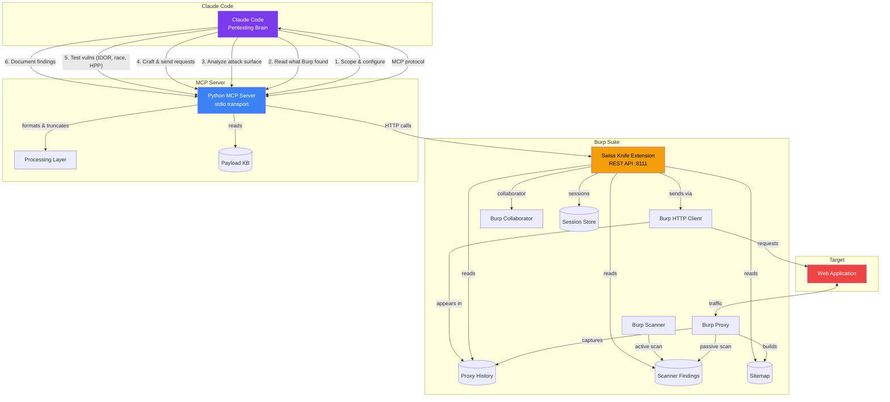
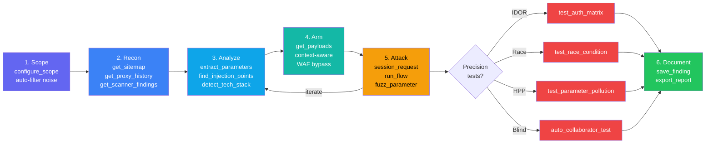

# Burp Suite Swiss Knife MCP

Claude Code as your pentesting brain — connected to Burp Suite.

## Architecture



## Workflow



## Setup

### 1. Build & Load the Burp Extension

```bash
cd burp-extension
mvn package
```

Load `target/burpsuite-swiss-knife-0.1.0.jar` in Burp Suite:
- **Extensions → Add → Java → Select JAR**
- Verify: check Burp's output log for "Swiss Knife MCP started on port 8111"

### 2. Install the Python MCP Server

```bash
cd mcp-server
uv venv
uv pip install -e .
```

### 3. Configure Claude Code

Add to your project `.mcp.json`:

```json
{
  "mcpServers": {
    "burpsuite": {
      "command": "/absolute/path/to/mcp-server/.venv/bin/python",
      "args": ["-m", "burpsuite_mcp"]
    }
  }
}
```

## Tools (56 total)

### Scope & Configuration
| Tool | Description |
|------|-------------|
| `configure_scope` | One-call scope setup with include/exclude patterns + auto-filter ~60 tracker/ad/CDN noise domains |
| `get_scope` | Current target scope rules |
| `check_scope` | Check if URL is in scope |
| `add_to_scope` | Add URL to scope |
| `remove_from_scope` | Remove URL from scope |

### Session Management
| Tool | Description |
|------|-------------|
| `create_session` | Persistent attack session with cookies, headers, auth tokens |
| `session_request` | Craft any request freely — auto-applies session state, cookie jar auto-updates |
| `extract_token` | Pull CSRF/session/any value from responses via regex, json_path, header, cookie |
| `run_flow` | Multi-step attack chain in one call — login + extract CSRF + exploit with `{{variable}}` interpolation |
| `list_sessions` | List active sessions with state summary |
| `delete_session` | Clean up sessions |

### Read (what Burp found)
| Tool | Description |
|------|-------------|
| `get_proxy_history` | Proxy history with filters (URL, method, status) |
| `get_request_detail` | Full request/response for a history item |
| `get_scanner_findings` | Scanner findings by severity/confidence |
| `get_sitemap` | All discovered URLs from sitemap |
| `get_cookies` | Cookies from Burp's cookie jar |
| `get_websocket_history` | WebSocket messages from proxy |

### Analyze (attack surface)
| Tool | Description |
|------|-------------|
| `extract_parameters` | All params from a request (query, body, cookie) |
| `extract_forms` | HTML forms and inputs from response |
| `extract_api_endpoints` | API paths, JS fetch calls, links |
| `find_injection_points` | Risk-scored injection points (SQLi, XSS, SSRF...) |
| `detect_tech_stack` | Server tech, frameworks, security headers |
| `extract_js_secrets` | AWS keys, tokens, passwords, internal URLs (TruffleHog-quality) |
| `get_unique_endpoints` | Deduplicated endpoints with parameter names |
| `analyze_dom` | DOM structure + JS sink/source/prototype pollution analysis |

### Send (through Burp)
| Tool | Description |
|------|-------------|
| `send_http_request` | Send structured HTTP request through Burp |
| `send_raw_request` | Send raw HTTP bytes (request smuggling) |
| `curl_request` | curl-like with redirects, Basic/Bearer auth, cookies |
| `resend_with_modification` | Modify and resend a history request |
| `send_to_repeater` | Send request to Repeater tab |
| `send_to_intruder` | Send request to Intruder |

### Precision Attack Tools
| Tool | Description |
|------|-------------|
| `test_auth_matrix` | Test N endpoints x M auth states — detects IDOR and broken access control |
| `test_race_condition` | Fire N concurrent requests simultaneously — detects double-spend, TOCTOU |
| `test_parameter_pollution` | Test HPP across query/body/mixed positions |
| `fuzz_parameter` | Smart fuzzing with sniper/battering_ram/pitchfork/cluster_bomb modes |
| `compare_auth_states` | Compare responses with/without auth for IDOR detection |
| `compare_responses` | Enhanced response diff (headers, body, unique words) |
| `send_to_comparer` | Send two items to Burp's Comparer |

### Payload Knowledge Base
| Tool | Description |
|------|-------------|
| `get_payloads` | Context-aware payloads from HackTricks/PayloadsAllTheThings — XSS, SQLi, SSTI, SSRF, command injection, path traversal, XXE, auth bypass, CORS, CSRF, race condition, HPP |

### Correlate
| Tool | Description |
|------|-------------|
| `search_history` | Search history by query, method, status |
| `get_findings_for_endpoint` | All findings (scanner + manual) for a URL |
| `get_response_diff` | Diff two responses |

### Scanner (Burp Professional)
| Tool | Description |
|------|-------------|
| `scan_url` | Start active scan on URL(s) |
| `crawl_target` | Spider/crawl to discover endpoints |
| `get_scan_status` | Check scan progress |

### Collaborator (OOB testing)
| Tool | Description |
|------|-------------|
| `generate_collaborator_payload` | Generate Collaborator URL for blind testing |
| `get_collaborator_interactions` | Check for DNS/HTTP/SMTP callbacks |
| `auto_collaborator_test` | One-step: inject + send + poll for blind vulns |

### Export & Resources
| Tool | Description |
|------|-------------|
| `export_sitemap` | Export as compact JSON or OpenAPI 3.0 |
| `get_static_resources` | List JS/CSS/source maps in proxy history |
| `fetch_resource` | Fetch specific JS/CSS file content |
| `fetch_page_resources` | Auto-fetch all resources linked from a page |

### Notes & Reporting
| Tool | Description |
|------|-------------|
| `save_finding` | Save a vulnerability finding |
| `get_findings` | List saved findings |
| `export_report` | Export as markdown or JSON report |

### Utility
| Tool | Description |
|------|-------------|
| `decode_encode` | base64, URL, HTML, hex, JWT decode, MD5/SHA1/SHA256, double URL encode, unicode escape |

## Design Philosophy

- **Precision over spray** — no mass brute force or enumeration. Use nuclei/sqlmap/ffuf for that. This tool focuses on intelligent, context-aware vulnerability testing.
- **Token efficient** — one smart tool call > five chatty ones. `run_flow` executes multi-step attacks in a single call.
- **Claude crafts the attack** — tools are execution engines, not decision makers. Claude thinks, tools execute.
- **Building blocks + smart helpers** — low-level primitives for creative attack chaining, plus high-level tools where server-side coordination matters (race conditions, auth matrix).
- **Payload knowledge fills gaps** — Claude knows basic payloads but not Angular sandbox bypass or Spring SSTI. The curated knowledge base provides advanced/evasive techniques.

## Environment Variables

| Variable | Default | Description |
|----------|---------|-------------|
| `BURP_API_HOST` | `127.0.0.1` | Burp extension host |
| `BURP_API_PORT` | `8111` | Burp extension port |
| `BURP_API_TIMEOUT` | `30` | Request timeout (seconds) |
| `BURP_MAX_RESPONSE_SIZE` | `50000` | Max response body chars |

## Requirements

- Burp Suite Professional (for scanner + collaborator) or Community Edition
- Java 21+
- Python 3.11+
- Claude Code
