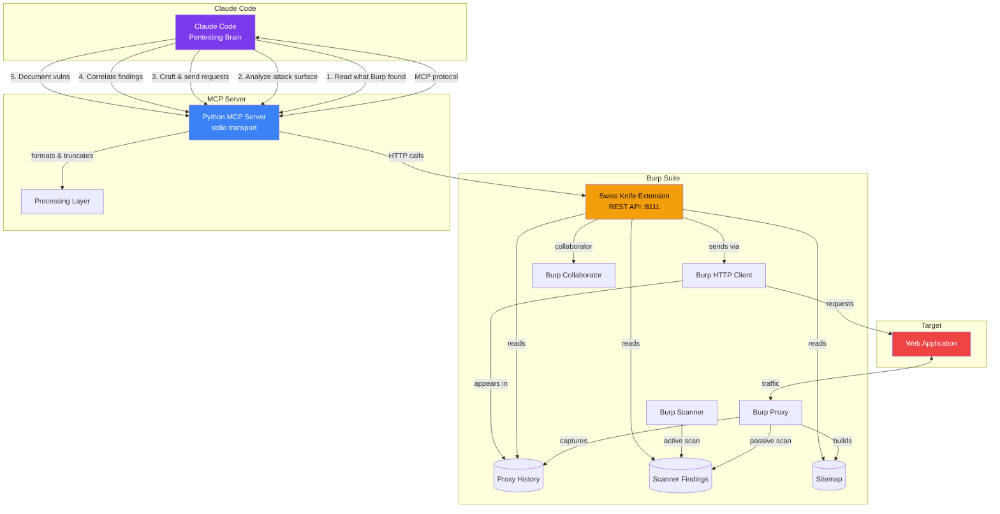
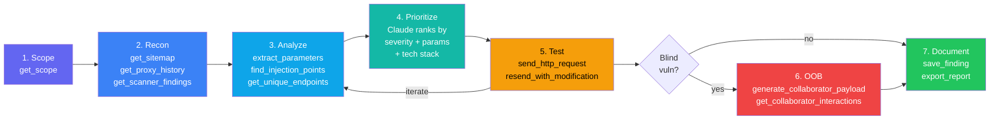
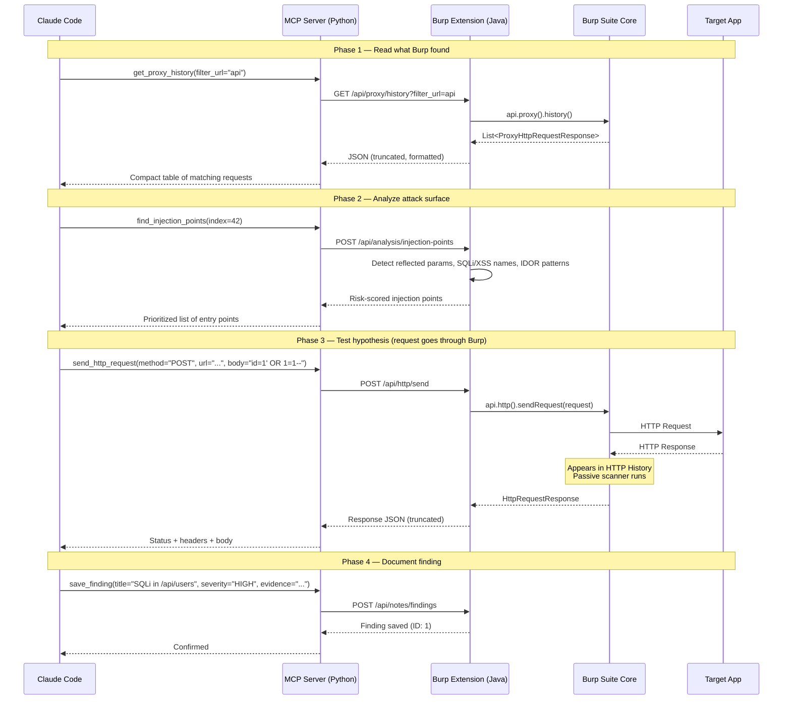

# Burp Suite Swiss Knife MCP

Claude Code as your pentesting brain — connected to Burp Suite.

## Architecture



## Workflow



## Component Interaction



## Setup

### 1. Build & Load the Burp Extension

```bash
cd burp-extension
mvn package
```

Load `target/burpsuite-swiss-knife-0.1.0.jar` in Burp Suite:
- **Extender → Add → Java → Select JAR**
- Verify: check Burp's output log for "Swiss Knife MCP started on port 8111"

### 2. Install the Python MCP Server

```bash
cd mcp-server
python3 -m venv .venv
source .venv/bin/activate
pip install -e .
```

### 3. Configure Claude Code

Add to your Claude Code MCP settings (`~/.claude/claude_desktop_config.json` or project `.mcp.json`):

```json
{
  "mcpServers": {
    "burpsuite": {
      "command": "/absolute/path/to/mcp-server/.venv/bin/python",
      "args": ["-m", "burpsuite_mcp"]
    }
  }
}
```

## Tools (25 total)

### Read (what Burp found)
| Tool | Description |
|------|-------------|
| `get_proxy_history` | Proxy history with filters (URL, method, status) |
| `get_request_detail` | Full request/response for a history item |
| `get_scanner_findings` | Scanner findings by severity/confidence |
| `get_sitemap` | All discovered URLs from sitemap |
| `get_scope` | Current target scope |
| `check_scope` | Check if URL is in scope |

### Analyze (attack surface)
| Tool | Description |
|------|-------------|
| `extract_parameters` | All params from a request (query, body, cookie) |
| `extract_forms` | HTML forms and inputs from response |
| `extract_api_endpoints` | API paths, JS fetch calls, links |
| `find_injection_points` | Risk-scored injection points (SQLi, XSS, SSRF...) |
| `detect_tech_stack` | Server tech, frameworks, security headers |
| `get_unique_endpoints` | Deduplicated endpoints with parameter names |

### Send (through Burp → appears in HTTP history)
| Tool | Description |
|------|-------------|
| `send_http_request` | Send structured HTTP request through Burp |
| `send_raw_request` | Send raw HTTP bytes through Burp |
| `resend_with_modification` | Modify and resend a history request |
| `send_to_repeater` | Send request to Repeater tab |
| `send_to_intruder` | Send request to Intruder |

### Correlate
| Tool | Description |
|------|-------------|
| `search_history` | Search history by query, method, status |
| `get_findings_for_endpoint` | All findings for a specific URL |
| `get_response_diff` | Diff two responses |

### Collaborator (OOB testing)
| Tool | Description |
|------|-------------|
| `generate_collaborator_payload` | Generate Collaborator URL |
| `get_collaborator_interactions` | Check for DNS/HTTP/SMTP callbacks |

### Notes & Reporting
| Tool | Description |
|------|-------------|
| `save_finding` | Save a vulnerability finding |
| `get_findings` | List saved findings |
| `export_report` | Export as markdown or JSON |

## Environment Variables

| Variable | Default | Description |
|----------|---------|-------------|
| `BURP_API_HOST` | `127.0.0.1` | Burp extension host |
| `BURP_API_PORT` | `8111` | Burp extension port |
| `BURP_API_TIMEOUT` | `30` | Request timeout (seconds) |
| `BURP_MAX_RESPONSE_SIZE` | `50000` | Max response body chars |

## Requirements

- Burp Suite Professional (for scanner findings + collaborator) or Community
- Java 21+
- Python 3.11+
- Claude Code
